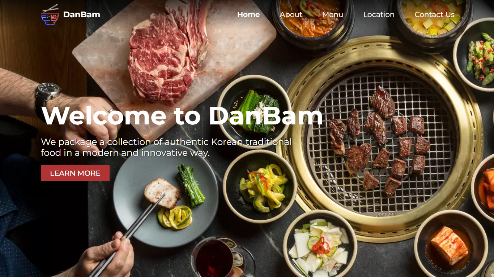

# DanBam
This is the landing page of **DanBam**, a fictitious Korean restaurant featured in the K-drama hit *[Itaewon Class](https://www.google.com/url?sa=t&rct=j&q=&esrc=s&source=web&cd=&cad=rja&uact=8&ved=2ahUKEwit08D8kdv6AhXlkOYKHUB8AZ0QFnoECB8QAQ&url=https%3A%2F%2Fen.wikipedia.org%2Fwiki%2FItaewon_Class&usg=AOvVaw0_Jpi2Qo4o9j4DGfYT-R9P)*. 

This project was built for the [COMP6176 - Human and Computer Interaction](https://curriculum.binus.ac.id/course/COMP6176/) course's group project.

[Visit the website here](https://hci-danbam.itslouisgs.repl.co/)

